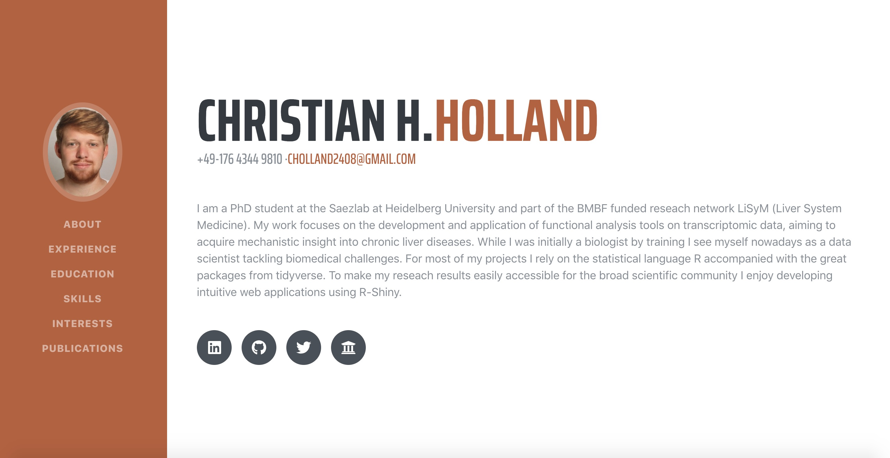

# Portfolio

<!-- badges: start -->

<!-- badges: end -->

### Development and Deployment
The portfolio was built and deployed using React and tools from GitHub Student Developer Pack.

The hosted version of this repository is live at [christianholland.me](https://christianholland.me) and [https://christianholland.herokuapp.com/](https://christianholland.herokuapp.com/).

### Acknowledgement
The skeleton of this portfolio was drawn from [here](https://github.com/Anupam-dagar/GitHub-Education-Portfolio) and adapted according to the [tutorial](https://levelup.gitconnected.com/create-a-portfolio-using-react-and-github-student-developer-pack-955379207855) from [Anupam-dagar](https://github.com/Anupam-dagar).

This project was bootstrapped with [Create React App](https://github.com/facebook/create-react-app).  
The Bootstrap template used in this tutorial is [https://github.com/BlackrockDigital/startbootstrap-resume](https://github.com/BlackrockDigital/startbootstrap-resume)
